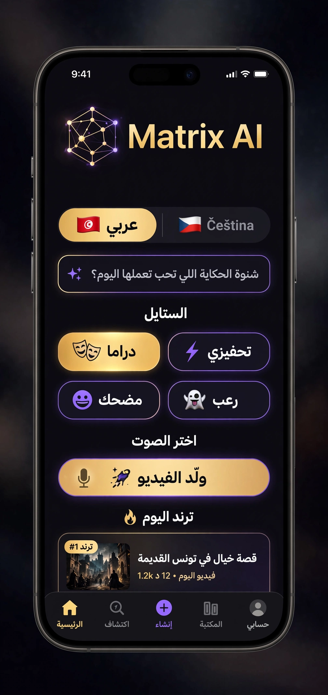

  <h1>Matrix AI 🚀</h1>
  

    <strong>محرك القصص الذكي لمُبدعي التيك توك والـ YouTube Shorts</strong>
  

  

    🇹🇳 عربي | 🇨🇿 Čeština
  

  
  اكتب جملة، وخوذ فيديو 30 ثانية جاهز بالصوت والصورة والـ Subtitles

---

## 📱 لقطات من التطبيق

  
  
<em>الشاشة الرئيسية - يدعم العربية 🇹🇳 والتشيكية 🇨🇿</em>

---

## ✨ كيفاش يخدم؟
1. **تكتب الفكرة**: "قصة نجاح شاب بدا من الصفر"
2. **تختار الستايل**: دراما، تحفيزي، مضحك
3. **تختار الصوت**: راجل ولا مرا
4. **تختار اللغة**: عربي 🇹🇳 ولا تشيكي 🇨🇿
5. **تستنى 60 ثانية**: وتاخو فيديو HD جاهز للتنزيل

## 🛠️ التقنيات
- **Frontend**: Flutter
- **Backend**: Python + FastAPI 
- **AI**: GPT-4o + Stable Diffusion XL + ElevenLabs

## 🌍 اللغات المدعومة
- **العربية** 🇹🇳 - RTL كامل + أصوات تونسية ومصرية وخليجية
- **Čeština** 🇨🇿 - LTR + أصوات تشيكية طبيعية

## 🚧 الحالة
قيد التطوير - MVP قريباً

---

  Made with ❤️ by matrix332008

